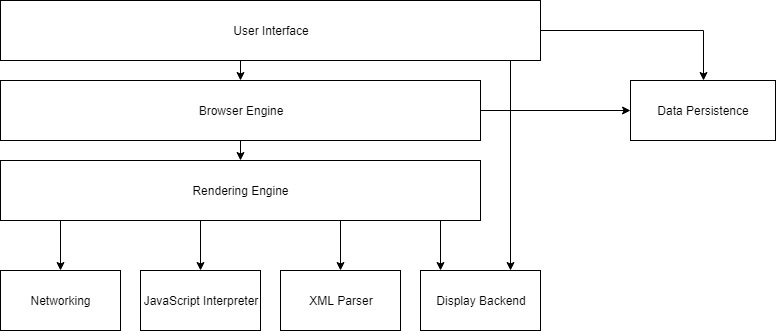
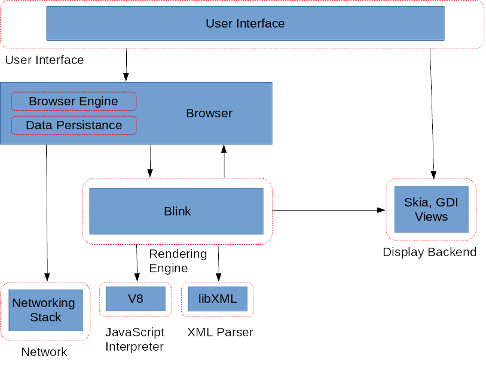
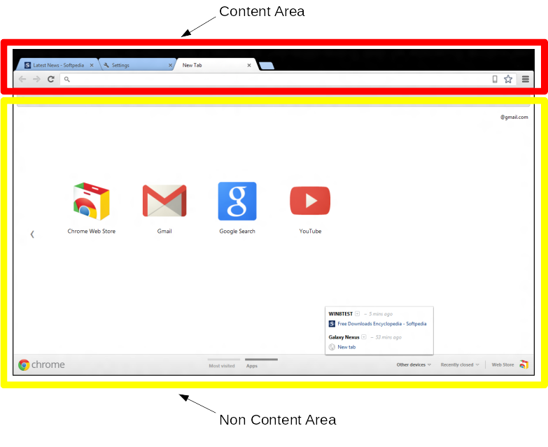
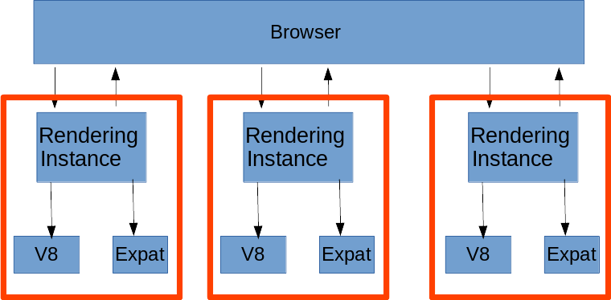
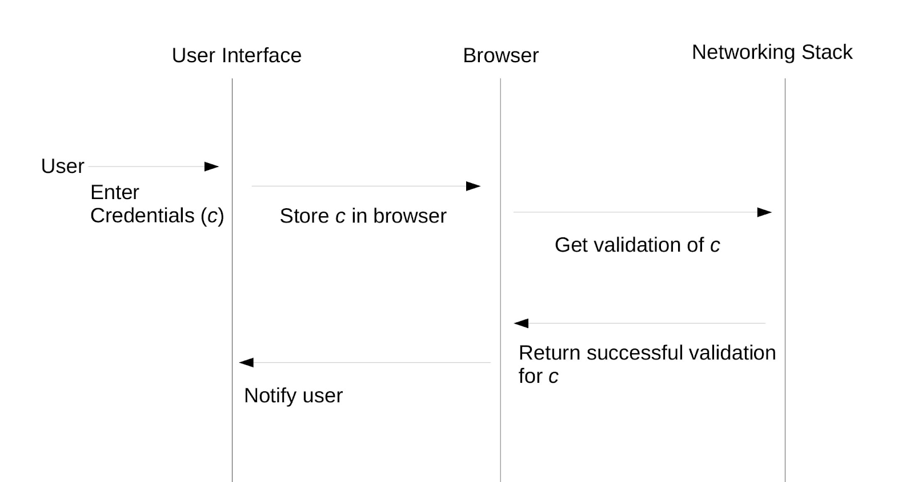

# Chromium Architecture Report
---

## Abstract

The following report is a review of our groups take on the Google Chromium web browser’s conceptual software architecture. Through this report, we will first describe the process of how we derived our conceptual architecture as well as the specific functionalities, overall use, and the dependencies of each subsystem found in the Chromium web browser. Secondly, in order to demonstrate how our derived conceptual architecture might work in a real-world setting, we also go over specific use cases and how the Chromium web browser handles them with the assistance of sequence diagrams. Lastly, we also take a look at the more human aspect of software development by exhibiting the Chrome team’s issues and the lessons learned by our own group.  

## Introduction

The Chromium web browser is a free web browser developed by Google and was released in 2008. It is a completely open-source project, designed to be a subset of the proprietary Chrome web browser. Chromium uses a layer style architecture, as most web browsers do, to achieve its functionality. From the beginning, Chromium tried to emphasize security, simplicity, speed, and stability for its web browser. As a result, over the past 10 years, this architecture has not changed too much. However, many modules and subsystems have been improved to try and continually push the limits of security, simplicity, speed, and stability.

In order to tackle the problem of developing a simple web browser, Google turned to the User Interface. Google decided, having a simple but user-friendly UI would help it achieve its goal of a simple web browser. Such a UI allowed the user to easily get where they wanted and do what they wanted in an efficient and natural way. Thanks to the simple UI, the complex underlying components of the Chromium web browser are not things that the user has to worry about. Instead, the user can focus on their needs and goals. 

Before the Google’s Chromium project, a majority of web browsers ran on a single process model. As the internet and websites evolved, such an architecture was deemed inefficient and ineffective. This is where the Chromium web browser comes in. The Chromium web browser was able to distinguish itself from other web browsers through its innovative multi-process architecture. From a browsers point of view, this meant that different tabs/windows ran in parallel, but with their own unique processes. This allowed Google to be successful in developing a secure, fast, and stable web browser. 

One of the main benefits to the multi-process architecture is how it helps improve the robustness of the Chromium web browser. Due to the fact that each tab is its own process, even if one tab crashes, other tabs are still accessible and the entire window continues to stay intact. In other words, even if one processes encounters a failure or crash, the browser and the other processes are secure. 

Even of the four S’s, security, simplicity, speed, and stability, Google put a large emphasis on security. Chromium’s multi-process architecture helps address security issues. One of the main components that help with security is concurrency and the sandboxing principle. These components help restrict the privileges that rendering engines have thus allowing for an overall more secure browser.

## Derivation Process

Our group began the derivation process by first taking a look at a generic reference architecture for web browsers. Just through this reference architecture, we were able to derive a basic structure for the Chromium web browser as research showed that Chrome used a very similar conceptual architecture. However, at this point in our derivation, we were still missing the specific subsystems that the Chromium web browser used. Thus, we continued to look for what kind of tools Chromium used for its major subsystems. Major subsystems include JavaScript Interpreter, XML parser, rendering engine, and display backend. Further research showed that the Chromium web browser used  V8 for its JavaScript interpreter, libxml2 for its XML parser, Blink for its rendering engine, and Skia/GDI views for its display backend. Most of this information was found through digging through different articles about the web browser as well as the official Chromium project documentation. With this newly found information about Chromium specific subsystems, we were able to further develop our very basic conceptual architecture. We began to add more detail to our initial architecture, but most of the large components and the architecture style itself remained the same.

*The Reference Architecture for Web Browsers*  

## Architecture Overview

The conceptual architecture of Chromium derived from the web browser reference architecture is almost exactly the same. As with the reference architecture, we have the layered style that characterizes most, if not all, web browsers, which provides it with the functionality it needs as a web browser. As with the layers in most web browsers, at the highest level abstraction is the User Interface. The next layer contains the Browser, which is followed by the third layer containing the renderer. As a layered architecture, Chromium is able to take advantage of the limited effect an implementation change has on the entire system. If we consider strictly the layered components, should the implementation of the Browser component change, only the effects would only be felt by the User Interface and Rendering Engine which has dependencies on it.

*Figure 1*
  

Also similar to the reference architecture is that one can say that it is an object-oriented architecture. Chromium's object-oriented characteristics give it the advantage of being able to hide the implementation details of each component from other components. There are two effects to this, the first being that because data from one component is hidden from another, security of the data is increased. The second effect is that because implementation details are hidden between each component, one is able to change the implementation of one without changing the function of others. For example, should the implementation of Blink change, the V8 interpreter and Expat parser would still properly function; nothing within those components would break.

The conceptual architecture differed from the reference in the interactions between components. One of the most notable differences is the inclusion of the Data Persistence component of the reference architecture into the browser component. This gives the renderer direct access to the persistent data stored in the browser. In addition, the Networking Stack interacts with the browser rather than the networking stack.

## Subsystems

### User Interface

The User Interface (UI) is the layout of the Chromium browser. It is what the user is able to see and how users are able to interact with Chromium’s functionality. The UI in Chromium is separated into two sections, the content area and the non content area. The content area is where actual content rendered by the rendering engine is displayed. This primarily displays the various web pages that a user will typically see when using Chromium. It primarily relies on output from the rendering engine via the browser. The non-content area refers to the rest of Chromium’s UI, which includes things such as Chromium’s windows, widgets, etc. This area of the UI primarily depends on Skia for the various graphics and text renderings, views to enable Chromium’s customized UI, and GDI and Windows API for a more native look.

*Figure 2*  

### Display Backend

The display backend contains the various libraries required to present to the user a usable, clean, and functional user interface. Included in this component are various graphic and font libraries and frameworks, including GDI, Skia, Views, and Windows API. 

The Windows API is provided by Windows and is a wrapper that refers to several subsets of APIs developed and provided by Windows. One of these subsets are APIs that assist in the drawing of windows, buttons, widgets, etc. As described in the Chromium documentation, these tools are primitive and were non-satisfactory for the Chromium development team, who wanted a customized UI. To do that they developed the Views Framework, which provides an easy way to develop the customized UI the Chromium team desired. The responsibilities of the Views framework include rendering, layout, and event handling.

In addition, the Skia graphics library is used. This is an in-house graphics library developed by Google, intended to replace GDI (Graphics Device Interface). Skia includes functionality not included in GDI, most notably the ability to control the opacity level and transparency. Additionally, it provided Chromium with the speed it would have lacked if it used GDI, which is not only slower but is no longer actively developed by Microsoft. However, GDI is still used for theming, in order to give it a more native look when on Windows.

### Browser

The browser engine is the central component of the Chromium browser. The browsers main functions include managing all the different subsystems of Chromium, window and tab management, user input handling, and network communication. One of the biggest differentiators of the Chromium browser compared to other browsers is its multi-process architecture. Such an architecture allows Chromium to run multiple tabs as different processes. This is possible due to the browser managing multiple instances of the renderer object. To be more specific, the browser oversees all the renderer objects through multiple Render Process Host (RPH) module instantiations. Each renderer object directly communicates with its correspondent RPH. 

### Data Persistence

Data persistence refers to any data component that continues to exist even after the exiting of the browser. Such components include cookies, history, and password databases. We are able to achieve data persistence even with a multi-process architecture by only maintaining communication with the browser and not the renderer objects. This helps keep information consistent throughout the entirety of Chromium, and easily allows different tabs the have access to the same information.

### Network (Networking Stack)

The network stack is a largely single-threaded library that is compatible across platforms. Its main function is connecting the browser to the network resources. This includes connecting servers to the browser in order to receive and send data.It also handles things such as fetching resources like Uniform Resource Locators, or URLs, and requesting resources like caches. Chromium supports 2 main and exclusive libraries, WinHTTP and WinINET.

### Rendering Engine (Blink)

The Blink rendering engine is an in-house rendering engine by the Chromium team. It is a fork of WebKit, which was the rendering engine of Chromium until 2014. As a rendering engine, Blink is responsible for everything that the user sees on a web page (or as discussed earlier the content area). 

What distinguishes Blink from other rendering engines is its integration in Chromium’s multi-process architecture. This architecture is essential to how Blink works and interacts with other components. Chromium will have one Browser for the session with many sandboxed rendering processes, usually one renderer instance per tab. This means that if a web page for one tab fails, it would only affect that single tab rather than crash the entire browser. A sandboxed rendering process simply means that access to data in other parts of Chromium or on the network is restricted, and the rendering must go through the browser process in order to obtain such data. Because each tab is sandboxed, this creates a dependency on the Browser component, as each time Blink requests additional data such as files on the network, and user data (cookies, passwords, etc.), it must go through the Browser.

*Figure 3*  

In addition, Blink also depends on the various interpreters and parsers that help interpret the code it must use. Displayed in the conceptual architecture in Figure 1 are the V8 JavaScript Interpreter and XML parser Expat. Without these two components, two of the most essential things involved in the rendering process are unavailable: the DOM tree and the JavaScript. 

It is worth noting that the rendering process within Blink is actually quite long but interestingly enough is a pipelined system. This shows how even though the functionality that Blink provides is quite sophisticated, the actual process in doing so is rather simple.

### JavaScript Interpreter (V8)

Chrome V8 is a JavaScript interpreter. JavaScript is a scripting language used alongside HTML to create websites. The interpreter helps load the page. The Chrome Development team wrote their own new interpreter because previous ones were too slow, and they wrote one that was much faster and better optimized for its time. V8 is faster because it bypasses many of the steps other interpreters use, directly turning the javascript into machine code that the system can read and use. V8 is open source, and was a large part of what made the Chrome Browser as important as it was.

### XML Parser (libxml2)

Chromium uses the XML parser libxml2 to parse the many XML files it receives every day. It will receive XML files from many different sources, whether it be a web page that needs to display its site information (this can be images, textfiles, and many other things) or from pages sending files to be downloaded as well as many other processes. It will then give this data to the Blink rendering engine, upon its request, which will process this data and display it to the user. This is why there is a dependency from the Blink engine to the libxml2 parser, as it requires all the XML received to be understood, allowing Chromium to display the correct information to the user. 

Libxml2 was written in the C language by the GNOME Projects, which is a large community of software developers, as well as artists, writers and many other people. Libxml2 was primarily headed by Daniel Veillard who also has a lot of documents online explaining the documentation and functionality of the library to developers who want to access and make use of it in their own applications. The libxml2 library is very portable, as it uses the ANSI C libraries, which means that many different applications are able to access, use, and compile new applications with it.

## Use Cases

### Successfully saving a password on login

### Rendering a web page with JavaScript content

## Team Issues

Over the years there have been many issues that have faced the Chromium browser that the development team has had to deal with. There are numerous example of bugs and issues the team had to solve and patch; from the simple bug to malicious developers injecting harmful code into the releases of the Chromium browser. The injection of code into open source projects is a big problem that the developers have to think about how to run an open source project that will not compromise the computer that it is being run on from malicious code. This is something that the Chromium team does not seem to deal with as well as they should because many people have made versions of Chromium that have malicious contented built into them and they affect the users. This has become such a big problem with the Chromium browser that there are many sources online claiming that the application is actually a virus and that it should be immediately removed from your computer. This is not something that a reputable company want to happen to a product of theirs, even if it is open source. 

Another big problem is actually joining the development team for the Chromium projects. This is because the chromium source code is incredibly large and is also, unfortunately, not very well documented. This leads new and aspiring developers with a big barrier to entry. They have to search through the source code, figure out how the different components interact with each other and understand how this all will run the application before being able to contribute anything meaningful to the application. This is something that should be very heavily regulated at with such a big project as it allows for a steady stream of new developers to be added to the project and contribute their ideas to the application as a whole.

## Lessons Learned

After our research on Chromium, we learned some things about working on large-scale projects like this one. One thing that is absolutely crucial to the success of the project, is having good documentation. You need thorough overviews of the architecture to make sure that newcomers can easily get started. Each file also needs to be documented so that it is clear what everything does. Without proper comments, the program can become incredibly messy and hard to maintain in the future.

Not only should you have good documentation, but that documentation needs to be updated any time the code is changed. Leaving old documentation can lead to even more confusion for people looking at your code.

Another important idea we learned is that the open-source nature of Chromium can be incredibly helpful for finding bugs and putting out faster updates. Anyone can easily contribute to the project and kind observers can spot errors in the codebase and report it. This leads to bugs being fixed exponentially faster than closed source projects. The Chromium team can even put up bounties for bugs that they need solved to get problems fixed faster.

## Conclusion

Over the past 10 years, Chromium has remained a large competitor in the web browser industry. It started as a great web browser and, with many updates, has become even faster and more capable. With a good foundation that focused on speed, simplicity, security and stability, Chromium was able to become a reliable browser for many people. Using multi-processor concurrency has helped the engine to stay reputable, by preventing crashes with its sandbox environments. Chromium’s concurrency has also helped to keep some virus at bay since they are trapped in an individual sandbox that can be killed while the program continues to run. It is no doubt that updating some core components, like Blink, has helped to keep the browser competitive, but the open-source nature, and powerful multi-processor concurrency has definitely aided in Chrome’s success.

## References

[Skia](https://skia.org/)
[Graphics Device Interface](https://en.wikipedia.org/wiki/Graphics_Device_Interface)
[Windows API](https://en.wikipedia.org/wiki/Windows_API)
[Chrome Views](https://www.chromium.org/developers/design-documents/chromeviews)
[Graphics and Skia](https://www.chromium.org/developers/design-documents/graphics-and-skia)
[How Blink Works](https://docs.google.com/document/d/1aitSOucL0VHZa9Z2vbRJSyAIsAz24kX8LFByQ5xQnUg)
[Chromium UI Development Practices](https://www.chromium.org/developers/design-documents/ui-development-practices)