# Concrete Architecture Report
---
## Abstract
This report looks at the how our individual research, use of `README`s and documentation, and the use of the Understand tool helped in the derivation of our group’s concrete architecture of the Chromium web browser. Through this report we will give a detailed description of each of the subsystems that are a part of the Chromium web browser as well as their functions. We will also do a reflexion analysis due to the differences of our initial conceptual architecture and our concrete architecture. To better demonstrate our understanding of the inner workings of the Chromium web browser, this report will also exhibit two use cases and their corresponding sequences. Finally, we will take a look at a potential new feature as well as some of Chromium team issues and the lessons learned by our own team.  

## Introduction
Chromium was first introduced by Google in 2008 as a free and open-source web browser. It used modern features and had a focus on the four S’s: speed, stability, safety, and simplicity. Throughout Chromium’s ten years of life, it has proven to be a huge competitor in the browser industry. The most important aspect of its lifetime is the ongoing development that has kept the browser up to date with many useful features, changes, and adaptations. One of most revolutionary features of the Chromium web browser is its multi-process architecture. Such an architecture allows different tabs/windows to be run in parallel but unique processes. Before Google’s Chromium project, the majority of other web browsers bore single-process architectures. As a result of its outstanding features and revolutionary architecture, the Chromium web browser has become the number one browser in the world.  

The main purpose of this report is to give a thorough review of the as-built, or concrete, architecture of the Chromium web browser. The findings of this report are based off the individual research of each member of team MOCO and the team’s collaborative discussions of said individual research. We will, firstly, go over the process of deriving our concrete architecture. This will include what individual work that was done and the tools used to examine the Chromium source code. Secondly, the report will give a concise overview of the concrete architecture that Team MOCO settled upon based on the derivation. the overview will also briefly examine any discrepancies between Team MOCO’s conceptual architecture from [Assignment 1](/assignment1) and the team’s concrete architecture that was  developed for this assignment. We will also give a description of all the major subsystems and their corresponding functions. From all the subsystems, the report will delve more deeply into two of the subsystems, the *XML Parser* and *Browser*, by analyzing their own architecture. Thirdly, this report will do a reflexion analysis in order to compare any additions, changes, and differences between Team MOCO’s conceptual and concrete architecture. Subsequently, the report will reflect Team MOCO’s deeper understanding of the Chromium source code through the use of two use cases and their corresponding sequence diagrams. The sequence diagrams will exhibit explicit function calls found from the source code. Additionally, this report will present a potential new feature for the Chromium web browser, reader mode. To conclude, this report will go over any team issues that were faced by the Chromium team and any lessons learned by Team MOCO during the duration of this assignment.  

## Derivation
The concrete architecture discussed in this report is derived using the given source code folder of the Chromium browser found on the CISC322 website, as well as the Chromium source code guide found on Chromium’s website.  

To begin the process of deriving the concrete architecture, we first ensured that all team members were able to successfully operate the Understand tool as well as open the given Understand project file found in the given Chromium source code. In this stage, many of us ran into initial problems extracting the code from the pre-packaged zip file on Windows, as Windows would extract only portions of the zip file with its built in zip extractor. This issue was quickly resolved through the use of a third party zip program.  

Once we ensured that everyone was able to access the source code within the tool, we assigned components from our conceptual architecture to each team member for them to focus on and map source code directories to. As we initially had problems knowing where to look and what to look for, we turned to the various `README`s found in the source directories for direction. This allowed us to map some of the directories to their respective architecture component quite accurately; for example, it was initially thought that the top-level directory `ui/` would belong to the *UI* component of the architecture. However, when looking at the description found in the `README` for that directory, it was discovered that the directory was actually one of various UI frameworks. This allowed us to deduce that the `ui/` directory was supposed to be mapped to the *Display Backend* component instead.  

However, there were also many directories which did not contain a `README`. We turned towards the Chromium documentation for more information, from which we found a site with high level descriptions of each directory. The site also contained descriptions for the many subdirectories of the `chrome/` and `content/` folders. This allowed us to continue mapping the various directories to their respective components.  

As we mapped the directories, it became apparent that some components, such as *XML Parser*, did not have their own directory; rather, it was a collection of individual files. In order to find such files, we were forced to do a search for such components relying on specific keywords in the file names, code comments, or the code itself. For example, in the case of *XML Parser*, we looked for its files using keywords like `xml`. This allowed us to ensure that each component contained directories or files that were attributed to it.

Once each individual of the team had confidence that they had done what they could to map the directories to their assigned component, we came together again to consolidate our findings. We worked out the differences and conflicts in our respective mappings and merged all the mappings together, generating our concrete architecture.  

*Figure 1: Architecture dependency graph*
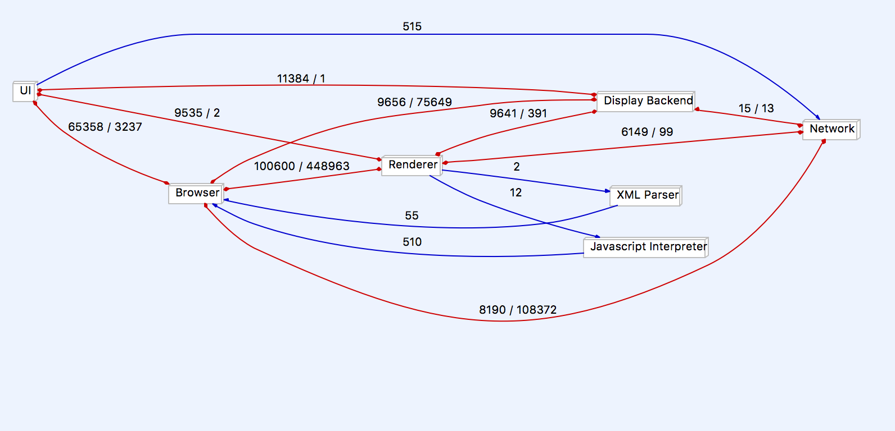

*Figure 2: Concrete Architecture of Chrome*
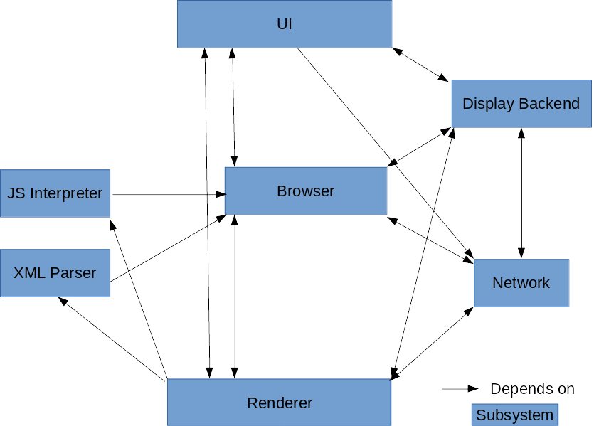

## Concrete Architecture
### Overview
The concrete architecture that was generated by our source code mappings to each component in our conceptual architecture by the Understand tool is object oriented. This differs from our conceptual architecture in that it loses the layered style that our conceptual architecture initially had. Because our concrete architecture is object oriented, it retains many of the advantages of the object oriented style, such as how the implementation details of each component/subsystem is hidden from the others. We also did not find a need to add any new components that weren’t already existing in our conceptual architecture to our concrete architecture.  

The concrete architecture did differ from the conceptual architecture in that there were many additional unexpected dependencies as a result of changing from a layered architecture style to a object-oriented architectural style. This is where the differences became much more notable; the concrete architecture was much more coupled than the conceptual architecture. These included one way dependencies that did not exist between components previously in the conceptual architecture, as well as new interdependencies between components. The details of such unexpected dependencies will be analysed later in the report.  

*Figure 3: Concrete architecture with marked unexpected dependencies*
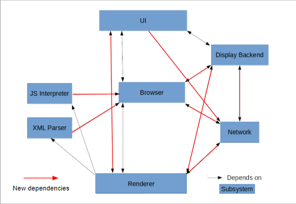

### Subsystems
The following offers a brief and high level overview of the functionality of the included subsystems.  

#### User Interface
The *User Interface (UI)* is responsible for displaying what the user sees and interacts with. As mentioned in the previous report, the *User Interface* is divided into two areas, the content area and the non-content area. The content area contains the actual web page being displayed to the user while the non-content area contains the various menus, widgets, and layout of the actual Chromium browser. Together, they provide an area for the user to interact with  

*Figure 4: UI-focused dependency graph*
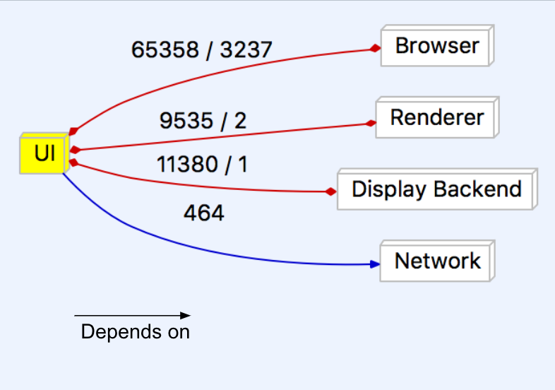

#### Browser
The *browser* is a multiprocessor system that manages most of the other subsystems, and can be thought of as a central control hub of Chromium. As a result of this, the *browser* manages the renderer and allows for the concurrency of each instance of the render object. In essence it separates and individualizes all instances of the render object from one another.  

#### Renderer
As the main new big feature of Chrome, the *renderer* is often seen as the most important part. Each instance of the renderer runs independent of the others, giving each their own sandbox, essentially allowing them to play in their own space, but not allowing them to mix. This keeps information safe from other tabs and if something goes wrong in one, the others will remain saved.  

*Figure 5: Renderer-focused dependency graph*
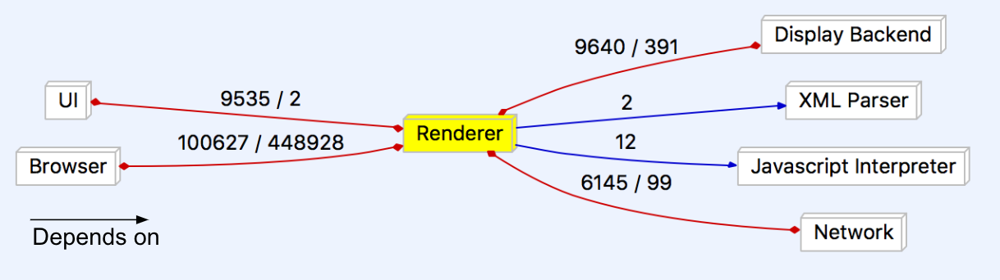

#### Networking Stack
The *network stack* is responsible for communicating with servers over the air to send and retrieve the information required to load pages. Most of its source files are found within the `net/` and `sql/` directories, although there are other files found in the `services/` directory as well. The *network stack* handles various tasks that need to be communicated over a network, including communication with remote servers, network printing, and file transfers over a network.  

#### Display Backend
The *display backend* is a component that supplies the renderer and UI with the necessary tools to draw and display elements. Fundamental to Chromium, the *display backend* works with the GPU to provide low-level access to graphics capabilities. The various UI frameworks are stored in the root level directory `ui/` and uses various graphics libraries that were not found in our analysis, most notable Skia and GDI.  

#### Javascript Interpreter
The JavaScript Interpreter for Chrome was designed in house by Google specifically for the Chrome browser. Chrome V8, as it is called, works by taking javascript files and translating them to help run web pages. V8 is much faster than previous Interpreters, due to the V8 translating javascript directly into native assembly, instead of first compiling the code to bytecode and then repeating bytecode to assembly. Google released V8 as an open source project, allowing anyone to develop their own personal projects with it. V8 is located almost exclusively in the `gin/` folder.  

*Figure 6: Javascript interpreter internal dependencies*
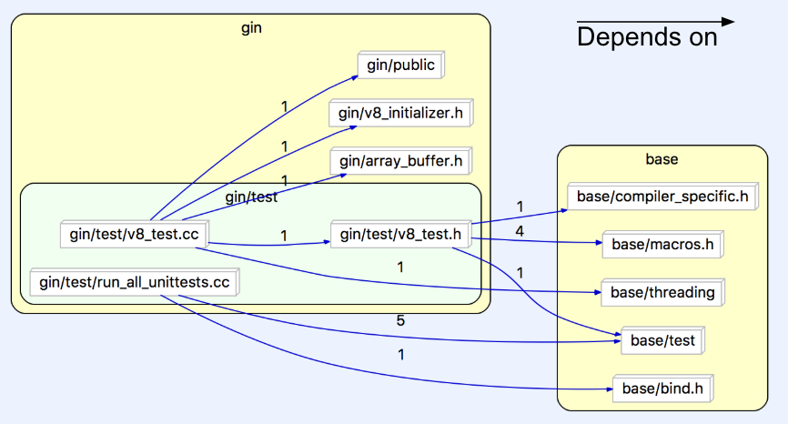

*Figure 7: Javascript interpreter-focused dependency graph*
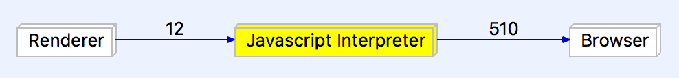

#### XML Parser
The *Parser* handles XML files so that the browser can then understand and use the information. Chromium uses the libXML parser library, which can be found within its source code. The *XML Parser* is needed in order to convert text into a XML DOM object, which contains the properties and methods needed to access and modify XML code.  

### Reflexion Analysis
#### Browser ↔ Network
When comparing Team MOCO’s original conceptual architecture to the new concrete architecture, there is an unexpected interdependency between the *browser* component and the *network stack*. The *network stack* depends on the *browser* for network-related crashes. In order for it to properly log errors and crashes, the *network* needs to access to the required functions from the *browser*.  

#### Browser ↔ Display Backend
In our conceptual architecture there was no link between the *browser* and *display backend* at all. The concrete architecture shows that these two components depend on each other. The *browser* requires the *display backend* to render certain graphics. On the other side, the *display backend* requires the *browser* to format URLs.  

#### Renderer ↔ Network
The *network*’s unexpected dependency on the *renderer* seems to stem from the need for wireless printing operations. It is a small feature that’s often overlooked, so a plan may not have been made for this feature. The likely reason for it is that someone just quickly added this feature without much planning. The *renderer*’s dependance on the *network* comes from its need for some resources related to SSL channel IDs and URL requests in the process of rendering browser context.  

#### Display → Renderer
The *display backend* depends on the *renderer* for some animations and compositing utilities.  

#### UI → Network
The *UI* depends on *Network* for MIME and URL utilities, as well as networking errors so they can be reported.  

#### UI → Renderer
Ideally the *UI* would not need to depend on the *renderer* for graphics, but some *renderer* files in the concrete architecture are required for the *UI* to display its elements. This is likely the result of some quick changes where the developer was not focused on writing good code.  

### Analysed Subsystems
#### Browser
The *browser* subsystem is the core of the Chromium architecture. A multi-process control hub, the browser manages the concurrency of sandboxed renderer instances through IPC connections. Essentially, the browser – or sometimes the “browser process” – is the main Chromium process that manages the individual tab and plugin processes, as well as running the *UI*. Each tab in turn has its own render process using the Blink rendering engine.  

*Figure 8: Multi-process architecture overview from Chromium developer documentation*
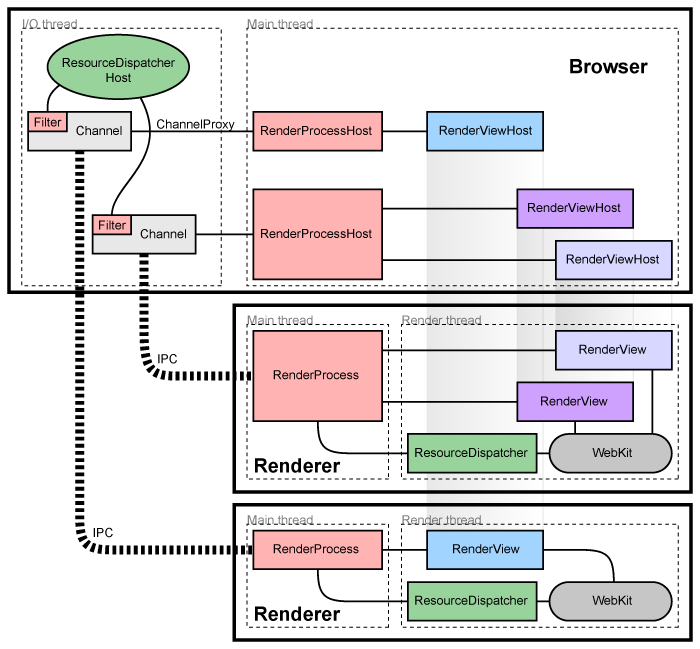

The figure above is the Chromium documentation diagram for how the multi-renderer concurrency is managed by the browser object via IPC.  

*Figure 9: Browser-focused dependency graph*
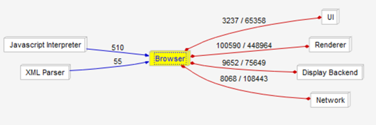

If the dependencies of the browser subsystem are focused on, it is clear to see how central it is to the operation of the system as a whole. This is a result of it being the key component to Chromium’s operation, directing and managing processes and operations from every other subsystem, as well as containing common operational elements. As such, every other subsystem heavily depends on it.  

*Figure 10: Browser internal architecture split into subsystems*
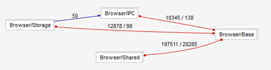

Internally, the browser can be split into four base components. The Base consists of all the base browser classes and functionality. Shared contains many common elements that are used by the browser as well as some other subsystems. Storage is the browser’s internal local storage system, including data persistence, download storage, file loading, caching, etc. Finally, IPC is what directly manages the control of tab render processes.  

*Figure 11: Browser internal architecture showing directories in each subsystem*
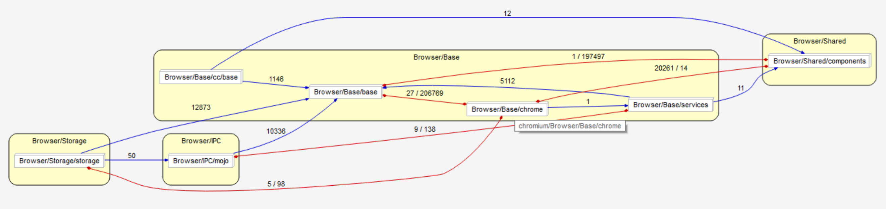

#### XML Parser (libxml2)
The *XML parser* that Google Chrome uses is the libxml2 parser. It takes in an XML input file and will parse the information and then execute commands based on the files contents. It uses the `libxml_utils` file for the main connection to the libxml2 library. It is located within the `third_party/` directory and all the main classes within the chromium directories that use XML files will access either this file or the `xml_parser` header or class file. The dependencies between `libxml_utils` and the other files can be seen in *figure 12*, with the `xml_parser.cc` class highlighted because of its importance to xml reading in chromium, which will be explained below. This graph shows how other parts of the application access the xml parser via `libxml_utils`. The `xml_parser` class is an important one because it is the class that many other classes use to parse XML files. This class access the libxml_utils class and will parse the inputted file from elsewhere in chromium. This file is able to parse the files that are inputted to it by accessing many other parts of the chromium architecture, which is shown in *figure 13*. The reason that it accesses all these other parts of the code, is so that it can successfully handle the different types of inputs that will arise from using the xml parse. Other classes are able to access this code by importing the `xml_parser.h` file, which in turn will obviously be imported by the `.cc` file that was just talked about. This is the architecture and interactions of the `xml_parser.h` and `.cc` files. One of the main files that will acced the `xml_parser.h` file is the `data_decoder_service.cc` file which handels a lot of XMl files from all over chromium, so it makes sense that such an important XML/data reader would require the immediate access to the libxml2 XML parser.  

*Figure 12: XML parser file dependencies on `libxml_utils.h`*
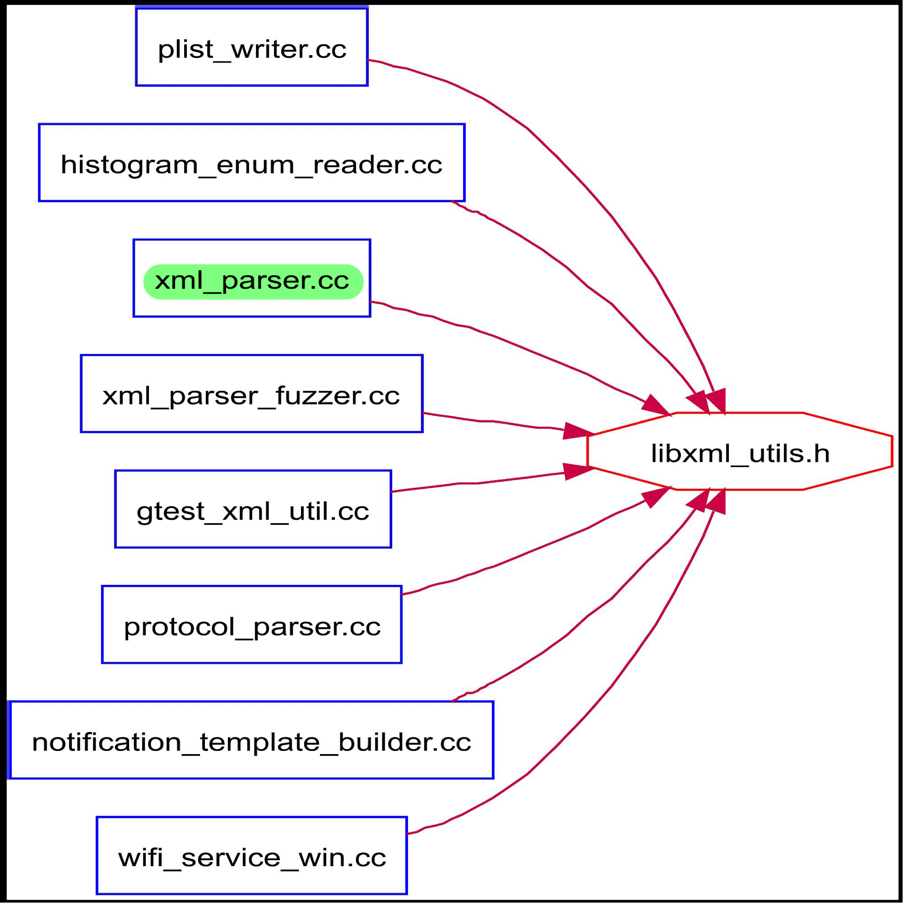

*Figure 13: File dependencies of `xml_parser.cc`*
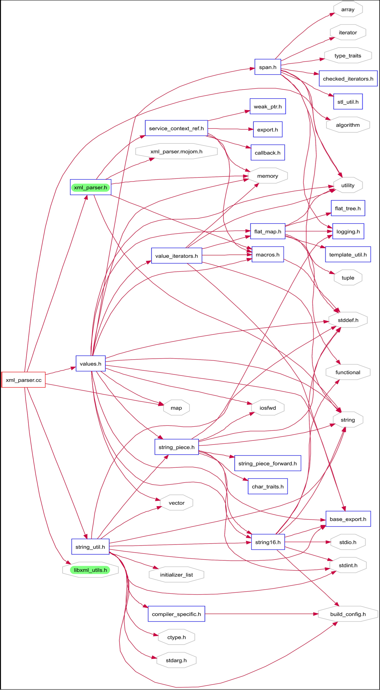

*Figure 14: File dependencies of `xml_parser.h`*
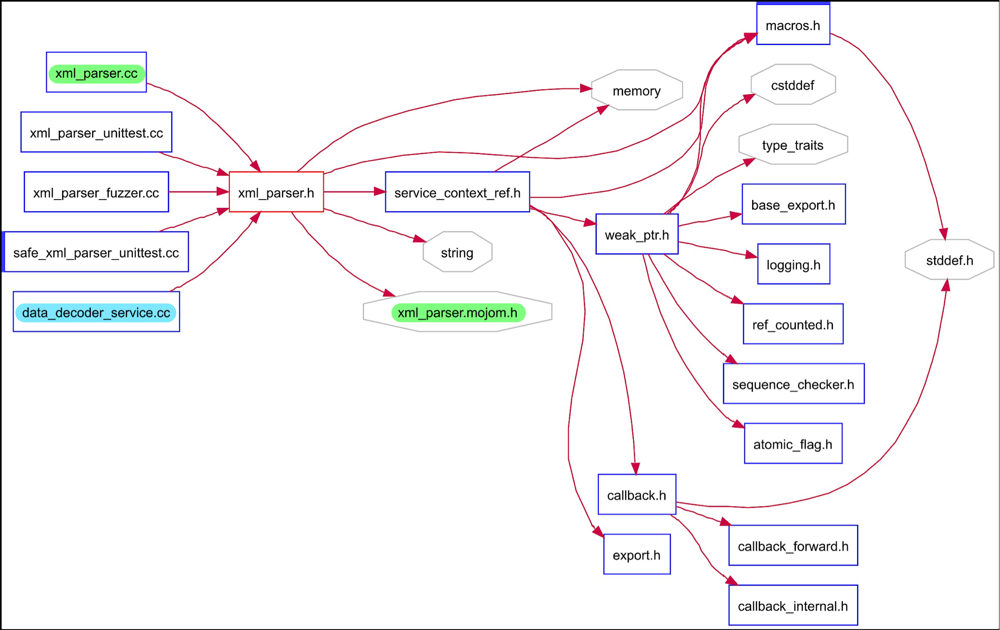

*Figure 15: XML parser-focused dependency graph*
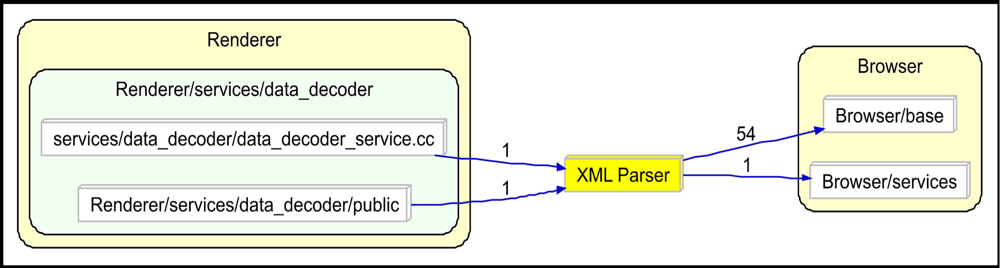

## Use Cases
### Storing a Password on Successful Login
*Figure 16: Storing a password on successful login sequence diagram*
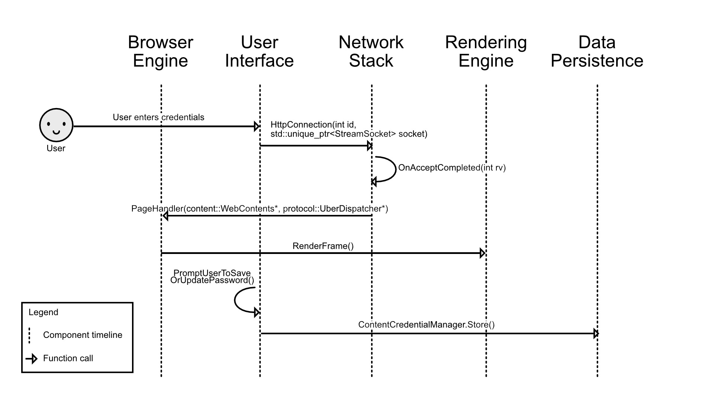

The sequence diagram above outlines the process as well as the specific function calls made by Chromium in the case of a password being stored after a successful login into some website. The first step of this process would be for the user to interact with the *User Interface* and enter the relevant credentials (including the/a password). Next, Chromium would call upon the `HttpConnection()` function in order to submit and load the URL to the *Network Stack*. The *network stack* will then get validation from the site server. Once complete, the *browser* retrieves the page info from the *network stack*. The page is rendered with `RenderFrame()` and then the *UI* prompts the user to save or update the password. Upon confirmation, the credentials are stored in data persistence.  

### Rendering a Webpage with Javascript
*Figure 17: Rendering a webpage with Javascript sequence diagram*
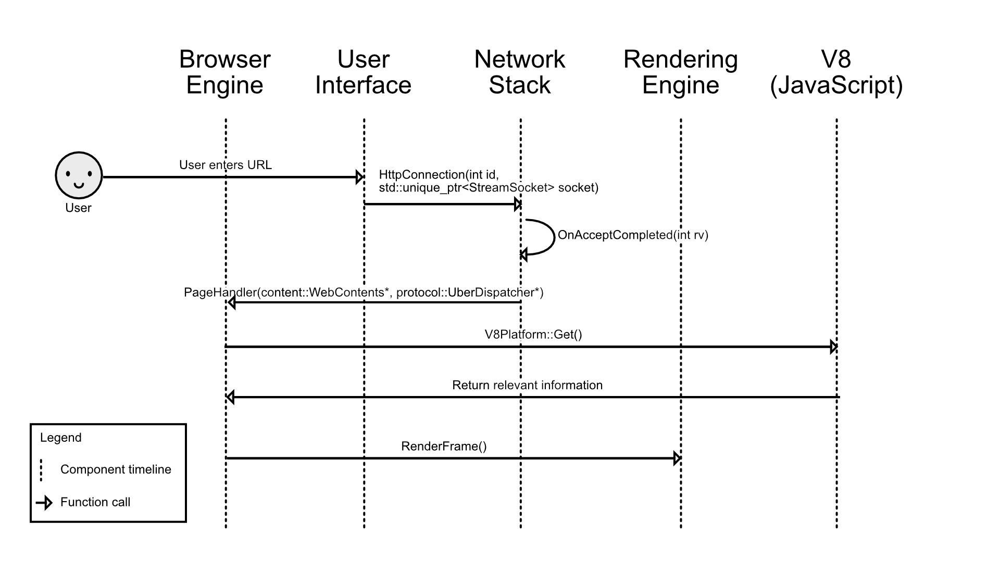

This sequence diagram shows how a webpage with JavaScript would be loaded and rendered. It starts with the user launching a new URL through the *UI* and the *network stack* establishing a connection with the server and receiving validation. The *browser* will get the page information from the *network* and V8 (the *JavaScript parser*) will get the JavaScript files and return the relevant information to the *browser*. Once everything is finished, the *renderer* will use the data to render the page.  

## New Feature Proposal: Reader Mode
For our new feature, we are suggesting a built-in reader mode for Chromium. This is a feature that is standard across many web browsers in 2018 and we think Chromium should adopt this helpful feature as well. This feature will be completely optional and the user can simply press a button or use a keyboard shortcut to convert a page into the reader mode. It will be very simple and user friendly.  

The new reader mode will simplify a page to make the format easier to read. It will clean the page by removing many unnecessary elements like ads. The user will be able to customize some elements to increase legibility, such as the font, colours, and text size. Many basic features of the web page will remain, like the links and images.  

To implement this feature we will need to modify both the *UI* and *renderer* components of the Chromium architecture. The *UI* will be needed to allow the user to easily swap in and out of reader mode so that they may use the feature when they like. The user will also need a way to adjust the settings of reader mode to make the web page perfect for their needs. The settings will also be a part of the *UI* to keep the feature simple and intuitive. To manipulate the actual web page, we will need to access the *renderer* to change how the page is actually drawn. We will not need to change anything with the site, we will only need to change the way it is presented to the user.  

*Figure 18: Reader mode on Microsoft Edge*
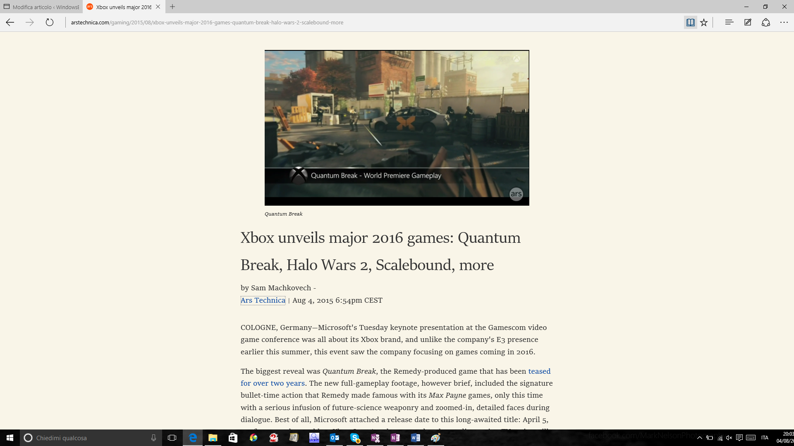

## Team Issues
The team ran into a few issues. Problems that came up during Chrome’s development caused the team to split into different sections unexpectedly, such as with the development of the *JavaScript Interpreter*, V8. A separate team worked on engine to get it working faster than any other *JavaScript interpreter*.  

Chrome has become such a large project that it can be hard for someone new to the team to get a grasp of how everything works, and this can take time until they are just as efficient as the other developers.  

## Lessons Learned
Through our research, our team has learned how to read and understand large codebases. The Chromium repository is incredibly large and difficult to look through; learning what each directory and file does is not a trivial undertaking. While we sifted through the behemoth that is called Chromium, we discovered many ways to help us navigate and learn the functions of the pieces. We found it incredibly helpful to utilize Understand and its graphing capabilities. This tool, used correctly, could show us how all of the parts of program connected. It created a web of files and directories that we could use to understand the layout of the components. When we started digging further, we needed to learn more about what each directory’s function was. We quickly found the `README`s located in most folders would give us a good idea of what we were looking at. `README`s are small text files that the developers leave for newcomers (or even veteran developers that have forgotten the meaning of a component) so that they may quickly learn the use of the individual parts.  

## Conclusion
Google’s Chromium web browser proved to be a tough nut to crack; however, in the end, we were able to manage. We maintained our conceptual architecture and continued to use it as we delved into the concrete architecture analysis. We used many additional resources, such as Understand, `README`s, and official documentation. Along the way we came up with a new feature that we believe would enhance Chrome and remove any shortcomings compared to other browsers: A Reader Mode. We now have a much better grasp of how Chromium works. With a good foundation that focused on speed, simplicity, security, and stability, Google’s Chrome has been able to become a reliable browser to many people.  

## References
[Understand Software](https://scitools.com)  
[Chromium Github](https://github.com/chromium/chromium)  
[Chromium Projects](https://www.chromium.org/)  

## Glossary
 - **UI** - abbreviation for *User Interface*
 - **`README`** - a short text file found in source code directories explaining the purpose and contents of the directory
 - **Understand** - the tool by SciTools used to analyse the Chromium source code for the generation of the concrete architecture